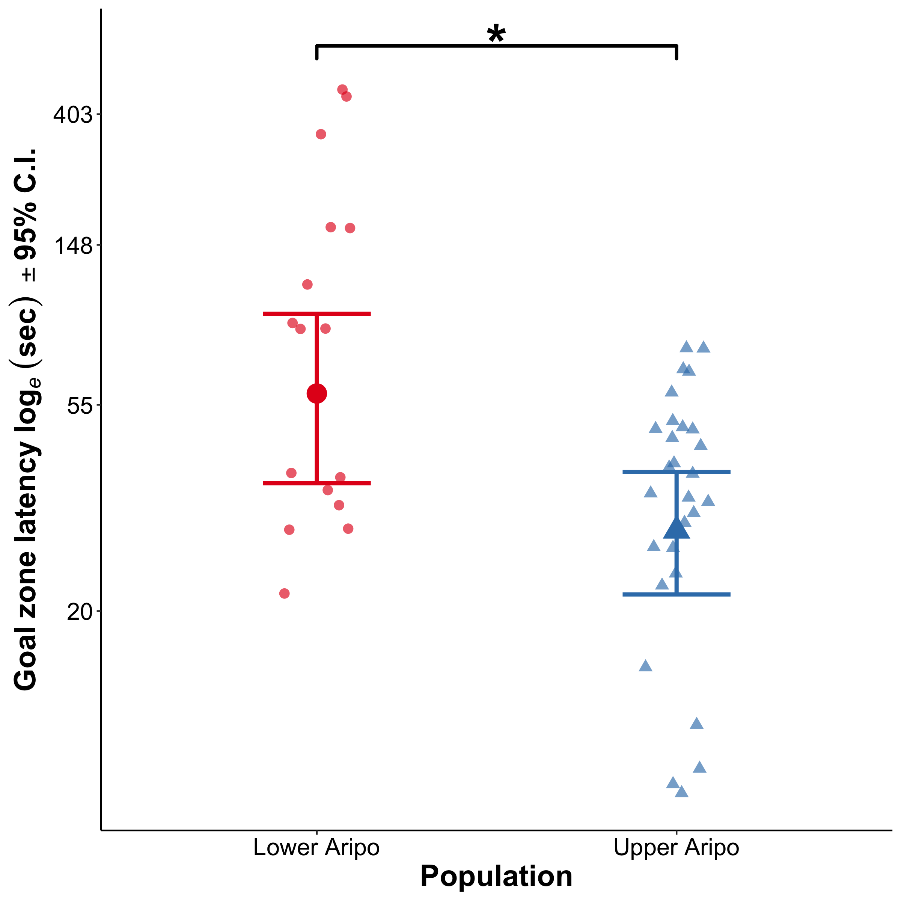
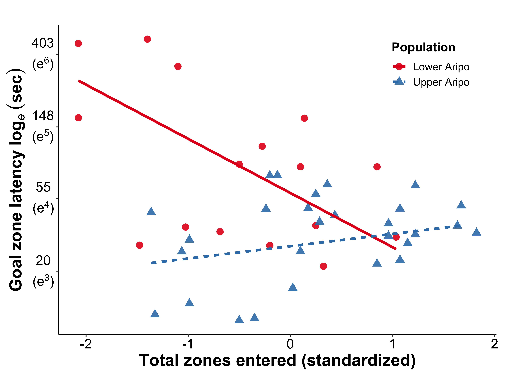

Analysis Summary for Sims and Reader 2020
================

  - [Analysis: Population comparisons](#analysis-population-comparisons)
      - [Setup](#setup)
      - [Population comparisons](#population-comparisons)
          - [Body length, total zones
            entered](#body-length-total-zones-entered)
          - [Innovation: Goal zone
            latency](#innovation-goal-zone-latency)
          - [Learning: Improvement ratio](#learning-improvement-ratio)
      - [All population comparison model
        summaries](#all-population-comparison-model-summaries)
  - [Analysis: Predictors of
    innovation](#analysis-predictors-of-innovation)
      - [Setup](#setup-1)
      - [Random-effect testing](#random-effect-testing)
      - [Fixed-effect selection](#fixed-effect-selection)
      - [Final model of predictors of
        innovation](#final-model-of-predictors-of-innovation)
  - [Figures](#figures)
      - [Setup](#setup-2)
      - [Population comparison of
        innovation](#population-comparison-of-innovation)
      - [Innovation predicted by total zones
        entered](#innovation-predicted-by-total-zones-entered)

# Analysis: Population comparisons

  - Author: Paul Q. Sims
  - Contact: <paul.q.sims@gmail.com>
  - Date: 2020
  - Purpose: Population comparison analyses for Sims and Reader 2020

<!-- end list -->

``` r
knitr::opts_knit$set(root.dir = rprojroot::find_rstudio_root_file(),
                     eval = TRUE, echo = TRUE, message = FALSE,
                     warning = FALSE)
knitr::opts_chunk$set(root.dir = rprojroot::find_rstudio_root_file(),
                     eval = TRUE, echo = TRUE, message = FALSE,
                     warning = FALSE)
```

## Setup

``` r
# Load libraries
library(tidyverse)  # for cleaning and modifying data
library(nlme)  # for mixed models and generalized least squares
library(broom)  # for tidying model output

# Load personalized functions
source("R/custom-functions.R")

# Read in data
data_analysis <-
  read_mod_data("data_Sims-Reader_2020")
```

## Population comparisons

### Body length, total zones entered

Create list of models for both variables

``` r
m_length_totz_popcomp_tidy <- 
  data_analysis %>%
  select(group, pop, trial, body_length_LN, tot_z_LN) %>%
  filter(trial == 1) %>% 
  pivot_longer(cols = c("body_length_LN", "tot_z_LN"),  # reshape data
               names_to = "response",
               values_to = "value") %>%
  group_by(response) %>%
  nest() %>%
  mutate(model = map(data, ~lm(value ~ pop, data = .)),  # run models for each
         tidy_model = map(model, tidy)) %>%  # tidy output
  unnest(tidy_model) %>%
  rd_tidy_out(.) %>%  # round variables
  select(-c(data, model))  # extract relevant columns 
```

Body length population comparison model summary

``` r
data_analysis %>%
  filter(trial == 1) %>%
  lm(body_length_LN ~ pop, data = .) %>%
  pretty_PredictTab(.)
```

<table>

<caption>

</caption>

<thead>

<tr>

<th style="text-align:left;">

term

</th>

<th style="text-align:left;">

estimate

</th>

<th style="text-align:left;">

std.error

</th>

<th style="text-align:left;">

statistic

</th>

<th style="text-align:left;">

p.value

</th>

</tr>

</thead>

<tbody>

<tr>

<td style="text-align:left;">

(Intercept)

</td>

<td style="text-align:left;">

3

</td>

<td style="text-align:left;">

0.03

</td>

<td style="text-align:left;">

101.11

</td>

<td style="text-align:left;">

\<0.001

</td>

</tr>

<tr>

<td style="text-align:left;">

popUpper Aripo

</td>

<td style="text-align:left;">

0.07

</td>

<td style="text-align:left;">

0.04

</td>

<td style="text-align:left;">

1.84

</td>

<td style="text-align:left;">

0.073

</td>

</tr>

</tbody>

</table>

Total zones entered population comparison model summary

``` r
data_analysis %>%
  filter(trial == 1) %>%
  lm(tot_z_LN ~ pop, data = .) %>%
  pretty_PredictTab(.)
```

<table>

<caption>

</caption>

<thead>

<tr>

<th style="text-align:left;">

term

</th>

<th style="text-align:left;">

estimate

</th>

<th style="text-align:left;">

std.error

</th>

<th style="text-align:left;">

statistic

</th>

<th style="text-align:left;">

p.value

</th>

</tr>

</thead>

<tbody>

<tr>

<td style="text-align:left;">

(Intercept)

</td>

<td style="text-align:left;">

4.27

</td>

<td style="text-align:left;">

0.08

</td>

<td style="text-align:left;">

53.56

</td>

<td style="text-align:left;">

\<0.001

</td>

</tr>

<tr>

<td style="text-align:left;">

popUpper Aripo

</td>

<td style="text-align:left;">

0.28

</td>

<td style="text-align:left;">

0.1

</td>

<td style="text-align:left;">

2.76

</td>

<td style="text-align:left;">

0.009

</td>

</tr>

</tbody>

</table>

### Innovation: Goal zone latency

Fit innovation model

``` r
# Create a data set without NAs - `lme()` won't remove them
data_analysis_NA_inno <-
  data_analysis %>%
  select(goal_z_lat_LN, pop, group,
         site_uni, trial) %>%
  drop_na() 

# Fit reduced model, see predictors of innovation section for how this model was obtained
m_inno_pop_comp <- 
  lme(goal_z_lat_LN ~ pop + trial,
      weights = varIdent(form = ~ 1|site_uni * pop),  # control for heteroscedasticity
      random = ~ 1 | group,
      contrasts = list(trial = c(-1,1)),  # Change trial contrasts for marginal effects for average trial 
      data = data_analysis_NA_inno,
      method = "REML")
```

Innovation population comparison model summary

``` r
# Tidy innovation predictor model
m_inno_pop_comp_tidy <-
  m_inno_pop_comp %>%
  pretty_PredictTab(., mixedModel = TRUE, kable = FALSE) %>%
  mutate(response = "goal_zone_lat_LN") %>%
  relocate(response) %>%
  filter(term != "trial1") %>%  # remove trial output as it is not of interest here
  select(-df)

m_inno_pop_comp_tidy %>%
  knitr::kable(.) 
```

<table>

<thead>

<tr>

<th style="text-align:left;">

response

</th>

<th style="text-align:left;">

term

</th>

<th style="text-align:left;">

estimate

</th>

<th style="text-align:left;">

std.error

</th>

<th style="text-align:left;">

statistic

</th>

<th style="text-align:left;">

p.value

</th>

</tr>

</thead>

<tbody>

<tr>

<td style="text-align:left;">

goal\_zone\_lat\_LN

</td>

<td style="text-align:left;">

(Intercept)

</td>

<td style="text-align:left;">

3.96

</td>

<td style="text-align:left;">

0.19

</td>

<td style="text-align:left;">

20.67

</td>

<td style="text-align:left;">

\<0.001

</td>

</tr>

<tr>

<td style="text-align:left;">

goal\_zone\_lat\_LN

</td>

<td style="text-align:left;">

popUpper Aripo

</td>

<td style="text-align:left;">

\-0.56

</td>

<td style="text-align:left;">

0.22

</td>

<td style="text-align:left;">

\-2.53

</td>

<td style="text-align:left;">

0.015

</td>

</tr>

</tbody>

</table>

### Learning: Improvement ratio

Fit learning population comparison model

``` r
# Create dataset without NAs - `lme()` won't remove them
data_analysis_NA_learn <-
  data_analysis %>%
  filter(trial == 1) %>%
  select(learn_prop_LN, pop, group, site_uni) %>%
  drop_na() 

m_learn_pop_comp <- 
  gls(learn_prop_LN ~ pop,
      weights = varIdent(form = ~ 1|site_uni * pop),
      data = data_analysis_NA_learn,
      method = "REML")
```

Population differences in learning model summary

``` r
# Tidy learning population comparison model
m_learn_pop_comp_tidy <-
  m_learn_pop_comp %>%
  pretty_PredictTab(., mixedModel = TRUE, kable = FALSE) %>%
  mutate(response = "improvement_ratio") %>%
  relocate(response)

# Model summary
m_learn_pop_comp_tidy %>%
  knitr::kable(.) 
```

<table>

<thead>

<tr>

<th style="text-align:left;">

response

</th>

<th style="text-align:left;">

term

</th>

<th style="text-align:left;">

estimate

</th>

<th style="text-align:left;">

std.error

</th>

<th style="text-align:left;">

statistic

</th>

<th style="text-align:left;">

p.value

</th>

</tr>

</thead>

<tbody>

<tr>

<td style="text-align:left;">

improvement\_ratio

</td>

<td style="text-align:left;">

(Intercept)

</td>

<td style="text-align:left;">

\-0.01

</td>

<td style="text-align:left;">

0.18

</td>

<td style="text-align:left;">

\-0.08

</td>

<td style="text-align:left;">

0.94

</td>

</tr>

<tr>

<td style="text-align:left;">

improvement\_ratio

</td>

<td style="text-align:left;">

popUpper Aripo

</td>

<td style="text-align:left;">

\-0.23

</td>

<td style="text-align:left;">

0.28

</td>

<td style="text-align:left;">

\-0.82

</td>

<td style="text-align:left;">

0.42

</td>

</tr>

</tbody>

</table>

Reduced learning model

  - Remove population to see if there was learning overall

<!-- end list -->

``` r
# update model to intercept only
m_learn <- update(m_learn_pop_comp, ~ 1)  

# Model summary: learning overall
pretty_PredictTab(m_learn)
```

<table>

<caption>

</caption>

<thead>

<tr>

<th style="text-align:left;">

term

</th>

<th style="text-align:left;">

estimate

</th>

<th style="text-align:left;">

std.error

</th>

<th style="text-align:left;">

statistic

</th>

<th style="text-align:left;">

p.value

</th>

</tr>

</thead>

<tbody>

<tr>

<td style="text-align:left;">

(Intercept)

</td>

<td style="text-align:left;">

\-0.09

</td>

<td style="text-align:left;">

0.14

</td>

<td style="text-align:left;">

\-0.7

</td>

<td style="text-align:left;">

0.49

</td>

</tr>

</tbody>

</table>

## All population comparison model summaries

``` r
# Bind all population comparisons together
m_pop_comp_final_tidy <-
  bind_rows(m_learn_pop_comp_tidy, m_inno_pop_comp_tidy,
            m_length_totz_popcomp_tidy) %>%
  rename(predictor = "term")

m_pop_comp_final_tidy %>% # See reduced inno predictor model for trial measure of learning
  knitr::kable(.) 
```

<table>

<thead>

<tr>

<th style="text-align:left;">

response

</th>

<th style="text-align:left;">

predictor

</th>

<th style="text-align:left;">

estimate

</th>

<th style="text-align:left;">

std.error

</th>

<th style="text-align:left;">

statistic

</th>

<th style="text-align:left;">

p.value

</th>

</tr>

</thead>

<tbody>

<tr>

<td style="text-align:left;">

improvement\_ratio

</td>

<td style="text-align:left;">

(Intercept)

</td>

<td style="text-align:left;">

\-0.01

</td>

<td style="text-align:left;">

0.18

</td>

<td style="text-align:left;">

\-0.08

</td>

<td style="text-align:left;">

0.94

</td>

</tr>

<tr>

<td style="text-align:left;">

improvement\_ratio

</td>

<td style="text-align:left;">

popUpper Aripo

</td>

<td style="text-align:left;">

\-0.23

</td>

<td style="text-align:left;">

0.28

</td>

<td style="text-align:left;">

\-0.82

</td>

<td style="text-align:left;">

0.42

</td>

</tr>

<tr>

<td style="text-align:left;">

goal\_zone\_lat\_LN

</td>

<td style="text-align:left;">

(Intercept)

</td>

<td style="text-align:left;">

3.96

</td>

<td style="text-align:left;">

0.19

</td>

<td style="text-align:left;">

20.67

</td>

<td style="text-align:left;">

\<0.001

</td>

</tr>

<tr>

<td style="text-align:left;">

goal\_zone\_lat\_LN

</td>

<td style="text-align:left;">

popUpper Aripo

</td>

<td style="text-align:left;">

\-0.56

</td>

<td style="text-align:left;">

0.22

</td>

<td style="text-align:left;">

\-2.53

</td>

<td style="text-align:left;">

0.015

</td>

</tr>

<tr>

<td style="text-align:left;">

body\_length\_LN

</td>

<td style="text-align:left;">

(Intercept)

</td>

<td style="text-align:left;">

3

</td>

<td style="text-align:left;">

0.03

</td>

<td style="text-align:left;">

101.11

</td>

<td style="text-align:left;">

\<0.001

</td>

</tr>

<tr>

<td style="text-align:left;">

body\_length\_LN

</td>

<td style="text-align:left;">

popUpper Aripo

</td>

<td style="text-align:left;">

0.07

</td>

<td style="text-align:left;">

0.04

</td>

<td style="text-align:left;">

1.84

</td>

<td style="text-align:left;">

0.073

</td>

</tr>

<tr>

<td style="text-align:left;">

tot\_z\_LN

</td>

<td style="text-align:left;">

(Intercept)

</td>

<td style="text-align:left;">

4.27

</td>

<td style="text-align:left;">

0.08

</td>

<td style="text-align:left;">

53.56

</td>

<td style="text-align:left;">

\<0.001

</td>

</tr>

<tr>

<td style="text-align:left;">

tot\_z\_LN

</td>

<td style="text-align:left;">

popUpper Aripo

</td>

<td style="text-align:left;">

0.28

</td>

<td style="text-align:left;">

0.1

</td>

<td style="text-align:left;">

2.76

</td>

<td style="text-align:left;">

0.009

</td>

</tr>

</tbody>

</table>

# Analysis: Predictors of innovation

  - Author: Paul Q. Sims
  - Contact: <paul.q.sims@gmail.com>
  - Date: 2020
  - Purpose: Predictors of innovation analyses for Sims and Reader 2020

<!-- end list -->

``` r
knitr::opts_knit$set(root.dir = rprojroot::find_rstudio_root_file(),
                     eval = TRUE, echo = TRUE, message = FALSE,
                     warning = FALSE)
knitr::opts_chunk$set(root.dir = rprojroot::find_rstudio_root_file(),
                     eval = TRUE, echo = TRUE, message = FALSE,
                     warning = FALSE)
```

## Setup

``` r
# Load libraries
library(tidyverse)  # for cleaning and modifying data
library(nlme)  # for mixed models and generalized least squares

# Load personalized functions
source("R/custom-functions.R")

# Read in data
data_analysis <-
  read_mod_data("data_Sims-Reader_2020")

# Create dataset without NAs - lme won't remove them
data_analysis_NA_inno <-
  data_analysis %>%
  select(goal_z_lat_LN, tot_z_sc, pop, group,
         site_uni, body_length_sc, trial) %>%
  drop_na() 
```

## Random-effect testing

Check if there are significant among-group differences

``` r
# Model formula for fixed-effects
inno_full_pred <- formula(goal_z_lat_LN ~ tot_z_sc * pop +  # fixed effect formula
                            body_length_sc * pop +
                            trial * pop)

# Fit model with group
m_inno_predict_full <-  
  lme(inno_full_pred,
      weights = varIdent(form = ~ 1|site_uni * pop),
      random = ~ 1 | group,
      data = data_analysis_NA_inno,
      method = "REML")

# Fit model without group
m1_inno_predict_red_rand <-  
  gls(inno_full_pred,
      weights = varIdent(form = ~ 1|site_uni * pop),
      data = data_analysis_NA_inno,
      method = "REML")

# Likelihood ratio test
anova(m_inno_predict_full, m1_inno_predict_red_rand) %>%
  as_tibble(.) %>%
  mutate(call = str_trunc(as.character(.$call), width = 10)) %>%  # condense call
  knitr::kable(., digits = 2, align = "l",
               caption = "Likielihood ratio test for group random effect") 
```

<table>

<caption>

Likielihood ratio test for group random effect

</caption>

<thead>

<tr>

<th style="text-align:left;">

call

</th>

<th style="text-align:left;">

Model

</th>

<th style="text-align:left;">

df

</th>

<th style="text-align:left;">

AIC

</th>

<th style="text-align:left;">

BIC

</th>

<th style="text-align:left;">

logLik

</th>

<th style="text-align:left;">

Test

</th>

<th style="text-align:left;">

L.Ratio

</th>

<th style="text-align:left;">

p-value

</th>

</tr>

</thead>

<tbody>

<tr>

<td style="text-align:left;">

lme.for…

</td>

<td style="text-align:left;">

1

</td>

<td style="text-align:left;">

13

</td>

<td style="text-align:left;">

246.26

</td>

<td style="text-align:left;">

276.73

</td>

<td style="text-align:left;">

\-110.13

</td>

<td style="text-align:left;">

</td>

<td style="text-align:left;">

NA

</td>

<td style="text-align:left;">

NA

</td>

</tr>

<tr>

<td style="text-align:left;">

gls(mod…

</td>

<td style="text-align:left;">

2

</td>

<td style="text-align:left;">

12

</td>

<td style="text-align:left;">

246.96

</td>

<td style="text-align:left;">

275.09

</td>

<td style="text-align:left;">

\-111.48

</td>

<td style="text-align:left;">

1 vs 2

</td>

<td style="text-align:left;">

2.7

</td>

<td style="text-align:left;">

0.1

</td>

</tr>

</tbody>

</table>

## Fixed-effect selection

Test significance of interactions

``` r
# Fit full model with ML 
m1_inno_predict_red_fix <-  
  update(m_inno_predict_full, method = "ML")

# Find largest non-significant p-value for interaction
model_sel_temp1 <- drop1(m1_inno_predict_red_fix, test = "Chi")
model_sel_temp1 %>%
  rd_stepwise_out(.) %>%
  knitr::kable(.) 
```

<table>

<thead>

<tr>

<th style="text-align:left;">

Variable

</th>

<th style="text-align:left;">

Df

</th>

<th style="text-align:left;">

AIC

</th>

<th style="text-align:left;">

LRT

</th>

<th style="text-align:left;">

p.value

</th>

</tr>

</thead>

<tbody>

<tr>

<td style="text-align:left;">

\<none\>

</td>

<td style="text-align:left;">

NA

</td>

<td style="text-align:left;">

233.03

</td>

<td style="text-align:left;">

NA

</td>

<td style="text-align:left;">

NA

</td>

</tr>

<tr>

<td style="text-align:left;">

tot\_z\_sc:pop

</td>

<td style="text-align:left;">

1

</td>

<td style="text-align:left;">

240.94

</td>

<td style="text-align:left;">

9.92

</td>

<td style="text-align:left;">

0.002

</td>

</tr>

<tr>

<td style="text-align:left;">

<pop:body_length_sc>

</td>

<td style="text-align:left;">

1

</td>

<td style="text-align:left;">

231.12

</td>

<td style="text-align:left;">

0.09

</td>

<td style="text-align:left;">

0.76

</td>

</tr>

<tr>

<td style="text-align:left;">

<pop:trial>

</td>

<td style="text-align:left;">

1

</td>

<td style="text-align:left;">

231.58

</td>

<td style="text-align:left;">

0.55

</td>

<td style="text-align:left;">

0.46

</td>

</tr>

</tbody>

</table>

``` r
# Remove largest non-significant p-value for interaction and update model and continue process
m1_temp <- update(m1_inno_predict_red_fix, ~ . -pop:body_length_sc)  # Remove most non-sig interactions
model_sel_temp2 <- drop1(m1_temp, test = "Chi")  # Update model and check remaining sig interactions
model_sel_temp2 %>%
  rd_stepwise_out(.) %>%
  knitr::kable(., caption = "No evidence for learning (i.e. trial) differences between populations (pop:trial)")
```

<table>

<caption>

No evidence for learning (i.e. trial) differences between populations
(<pop:trial>)

</caption>

<thead>

<tr>

<th style="text-align:left;">

Variable

</th>

<th style="text-align:left;">

Df

</th>

<th style="text-align:left;">

AIC

</th>

<th style="text-align:left;">

LRT

</th>

<th style="text-align:left;">

p.value

</th>

</tr>

</thead>

<tbody>

<tr>

<td style="text-align:left;">

\<none\>

</td>

<td style="text-align:left;">

NA

</td>

<td style="text-align:left;">

231.12

</td>

<td style="text-align:left;">

NA

</td>

<td style="text-align:left;">

NA

</td>

</tr>

<tr>

<td style="text-align:left;">

body\_length\_sc

</td>

<td style="text-align:left;">

1

</td>

<td style="text-align:left;">

229.47

</td>

<td style="text-align:left;">

0.35

</td>

<td style="text-align:left;">

0.55

</td>

</tr>

<tr>

<td style="text-align:left;">

tot\_z\_sc:pop

</td>

<td style="text-align:left;">

1

</td>

<td style="text-align:left;">

240.27

</td>

<td style="text-align:left;">

11.15

</td>

<td style="text-align:left;">

\<0.001

</td>

</tr>

<tr>

<td style="text-align:left;">

<pop:trial>

</td>

<td style="text-align:left;">

1

</td>

<td style="text-align:left;">

229.67

</td>

<td style="text-align:left;">

0.55

</td>

<td style="text-align:left;">

0.46

</td>

</tr>

</tbody>

</table>

``` r
m2_temp <- update(m1_temp, ~ . -pop:trial)  # same as above
model_sel_temp3 <- drop1(m2_temp, test = "Chi")  # same as above
model_sel_temp3 %>%
  rd_stepwise_out(.) %>%
  knitr::kable(.)
```

<table>

<thead>

<tr>

<th style="text-align:left;">

Variable

</th>

<th style="text-align:left;">

Df

</th>

<th style="text-align:left;">

AIC

</th>

<th style="text-align:left;">

LRT

</th>

<th style="text-align:left;">

p.value

</th>

</tr>

</thead>

<tbody>

<tr>

<td style="text-align:left;">

\<none\>

</td>

<td style="text-align:left;">

NA

</td>

<td style="text-align:left;">

229.67

</td>

<td style="text-align:left;">

NA

</td>

<td style="text-align:left;">

NA

</td>

</tr>

<tr>

<td style="text-align:left;">

body\_length\_sc

</td>

<td style="text-align:left;">

1

</td>

<td style="text-align:left;">

228.09

</td>

<td style="text-align:left;">

0.42

</td>

<td style="text-align:left;">

0.52

</td>

</tr>

<tr>

<td style="text-align:left;">

trial

</td>

<td style="text-align:left;">

1

</td>

<td style="text-align:left;">

228.08

</td>

<td style="text-align:left;">

0.41

</td>

<td style="text-align:left;">

0.52

</td>

</tr>

<tr>

<td style="text-align:left;">

tot\_z\_sc:pop

</td>

<td style="text-align:left;">

1

</td>

<td style="text-align:left;">

238.44

</td>

<td style="text-align:left;">

10.77

</td>

<td style="text-align:left;">

0.001

</td>

</tr>

</tbody>

</table>

``` r
# Final model of innovation predictors
inno_pred_reduc <- update(inno_full_pred, ~ .  # Update fixef model formula
                            -pop:body_length_sc -pop:trial)
```

## Final model of predictors of innovation

Fit final model

``` r
# Relevel population for testing total zones slope in other population
# data_analysis_NA_inno$pop <- relevel(data_analysis_NA_inno$pop, "Upper Aripo")  # Upper Aripo baseline
# data_analysis_NA_inno$pop <- relevel(data_analysis_NA_inno$pop, "Lower Aripo")  # Lower Aripo baseline, original 

# Fit final reduced model
m_inno_predict_reduc <- 
  lme(inno_pred_reduc,
      weights = varIdent(form = ~ 1|site_uni * pop),
      random = ~ 1 | group,
      contrasts = list(trial = c(-1,1)),  # Change trial contrasts in order to get marginal effects for average trial 
      data = data_analysis_NA_inno,
      method = "REML")
```

Final model summary

``` r
# Tidy model output
pretty_PredictTab(m_inno_predict_reduc,
                  title = "Predictors of goal zone latency",
                  mixedModel = TRUE) 
```

<table>

<caption>

Predictors of goal zone latency

</caption>

<thead>

<tr>

<th style="text-align:left;">

term

</th>

<th style="text-align:left;">

estimate

</th>

<th style="text-align:left;">

std.error

</th>

<th style="text-align:left;">

df

</th>

<th style="text-align:left;">

statistic

</th>

<th style="text-align:left;">

p.value

</th>

</tr>

</thead>

<tbody>

<tr>

<td style="text-align:left;">

(Intercept)

</td>

<td style="text-align:left;">

4.08

</td>

<td style="text-align:left;">

0.24

</td>

<td style="text-align:left;">

40

</td>

<td style="text-align:left;">

17.24

</td>

<td style="text-align:left;">

\<0.001

</td>

</tr>

<tr>

<td style="text-align:left;">

tot\_z\_sc

</td>

<td style="text-align:left;">

\-0.75

</td>

<td style="text-align:left;">

0.19

</td>

<td style="text-align:left;">

39

</td>

<td style="text-align:left;">

\-3.88

</td>

<td style="text-align:left;">

\<0.001

</td>

</tr>

<tr>

<td style="text-align:left;">

popUpper Aripo

</td>

<td style="text-align:left;">

\-0.73

</td>

<td style="text-align:left;">

0.28

</td>

<td style="text-align:left;">

39

</td>

<td style="text-align:left;">

\-2.62

</td>

<td style="text-align:left;">

0.013

</td>

</tr>

<tr>

<td style="text-align:left;">

body\_length\_sc

</td>

<td style="text-align:left;">

\-0.08

</td>

<td style="text-align:left;">

0.12

</td>

<td style="text-align:left;">

39

</td>

<td style="text-align:left;">

\-0.64

</td>

<td style="text-align:left;">

0.52

</td>

</tr>

<tr>

<td style="text-align:left;">

trial1

</td>

<td style="text-align:left;">

\-0.04

</td>

<td style="text-align:left;">

0.07

</td>

<td style="text-align:left;">

40

</td>

<td style="text-align:left;">

\-0.65

</td>

<td style="text-align:left;">

0.52

</td>

</tr>

<tr>

<td style="text-align:left;">

tot\_z\_sc:popUpper Aripo

</td>

<td style="text-align:left;">

0.92

</td>

<td style="text-align:left;">

0.25

</td>

<td style="text-align:left;">

39

</td>

<td style="text-align:left;">

3.74

</td>

<td style="text-align:left;">

\<0.001

</td>

</tr>

</tbody>

</table>

``` r
# R squared (delta)
knitr::kable(MuMIn::r.squaredGLMM(m_inno_predict_reduc),
      digits = 2, align = "l",
      caption = "Marginal and conditional R2")
```

<table>

<caption>

Marginal and conditional R2

</caption>

<thead>

<tr>

<th style="text-align:left;">

R2m

</th>

<th style="text-align:left;">

R2c

</th>

</tr>

</thead>

<tbody>

<tr>

<td style="text-align:left;">

0.59

</td>

<td style="text-align:left;">

0.87

</td>

</tr>

</tbody>

</table>

# Figures

  - Author: Paul Q. Sims
  - Contact: <paul.q.sims@gmail.com>
  - Date: 2020
  - Purpose: Plots for Sims and Reader 2020

<!-- end list -->

``` r
knitr::opts_knit$set(root.dir = rprojroot::find_rstudio_root_file(),
                     eval = TRUE, echo = TRUE, message = FALSE,
                     warning = FALSE)
knitr::opts_chunk$set(root.dir = rprojroot::find_rstudio_root_file(),
                      fig.path = "../figs/",
                     eval = TRUE, echo = TRUE, message = FALSE,
                     warning = FALSE, dev = c("png", "pdf"), dpi = 300)
```

## Setup

``` r
# Load libraries
library(tidyverse)  # for cleaning and modifying data
library(nlme)  # for mixed models and generalized least squares
library(ggplot2)  # for plots
library(ggsignif)  # for sig stars
library(effects)  # for marginal effects

# Load personalized functions
source("R/custom-functions.R")

# Read in data
data_analysis <-
  read_mod_data("data_Sims-Reader_2020")

# Create dataset without NAs - lme won't remove them
data_analysis_NA_inno <-
  data_analysis %>%
  select(goal_z_lat, goal_z_lat_LN, tot_z_sc, pop, group,
         site_uni, body_length_sc, trial) %>%
  drop_na() 

# Change trial contrasts in order to get marginal effects for average trial 
contrasts(data_analysis_NA_inno$trial) <- c(-1,1)
# contrasts(data_analysis_NA_inno$trial) # check

# Create reduced innovation model 
m_inno_predict_reduc <- 
  lme(goal_z_lat_LN ~ tot_z_sc * pop + body_length_sc + trial,
      weights = varIdent(form = ~ 1|site_uni * pop),
      random = ~ 1 | group,
      data = data_analysis_NA_inno)

# Obtain raw values for innovation, averaged between trial 1 and trial 2
data_inno_mean_plot <-
  data_analysis_NA_inno %>%
  group_by(group) %>%
  mutate(inno_mean = mean(goal_z_lat,
                          na.rm = TRUE),
         Population = pop) %>% # rename for total zones predictor plot for plot legend
  filter(trial == 1) 
```

## Population comparison of innovation

``` r
# Obtain predicted values for each population
#   marginal means, mean of trial, and total zones entered

data_inno_means <- 
  as.data.frame(
    Effect("pop", m_inno_predict_reduc,
           data_analysis_NA_inno)) %>%
    mutate(across(.cols = fit:upper, ~ exp(.x))) # back-transform to normal

# Plot estimated mean of innovation for each population
# data points represent raw latency values, averaged across trials

p <- ggplot(data_inno_mean_plot,  
            aes(x = pop,
                y = inno_mean,
                color = pop,
                shape = pop,
                fill = pop)) + 
  geom_point(size = 2.8,  # raw data points
             alpha = 0.65,
             position = position_jitterdodge(),
             show.legend = F) +
  geom_point(data = data_inno_means,  # population means
             aes(x = pop,
                 y = fit,
                 color = pop,
                 shape = pop,
                 fill = pop),
             size=5.8) +
  geom_errorbar(data = data_inno_means,  # population error bars
                aes(x = pop,
                    y = fit,
                    ymin=lower,
                    ymax=upper),
                width=.3,                    
                position = position_dodge(width = 0.9),
                size = 1.25) +
  geom_signif(comparisons = list(c("Lower Aripo", "Upper Aripo")),  # significance brackets 
              map_signif_level = T, annotation = "*", vjust = 0.65, 
              y_position = 6.6, color = "black", size = 1,
              textsize = 12, fontface = "bold") +
  xlab("Population") +
  ylab(expression(paste(bold(Goal~zone~latency~log)[italic(e)]~bold((sec))~bold(""%+-%"")*bold("95"*"%"~C.I.)))) +
  scale_color_manual(values = c("#E41A1C", "#377EB8","#377EB8"),
                     name = "Population") +
  scale_shape_discrete(name = "Population") + 
  scale_y_continuous(trans = "log",  # transforming Y axis to log scale
                     breaks = scales::trans_breaks("log", function(x) exp(x)), 
                     labels = scales::number_format(accuracy = 1)) +
  coord_trans(y = 'log') +  # transforming Y axis to log scale
  theme_bw() +
  theme(panel.grid.major = element_blank(),
        panel.grid.minor = element_blank(), 
        axis.title.x = element_text(face = "bold"),
        axis.text = element_text(color = "black"),
        axis.title.y = element_text(face = "bold"),
        panel.border = element_blank(),
        axis.line = element_line(),
        text = element_text(size = 19),
        legend.position = "none") 

print(p)
```

<!-- -->

## Innovation predicted by total zones entered

``` r
# Get min and max values for total zones entered for lower and upper aripo 
#   populations, restrict line plot values by raw data

tot_z_range <-  
  data_analysis_NA_inno %>%
  group_by(pop) %>%
  select(tot_z_sc) %>%
  summarize(min_totz = min(tot_z_sc, na.rm = TRUE),  # get real ranges of tot z
            max_totz = max(tot_z_sc, na.rm = TRUE)) %>%
  pivot_wider(names_from = pop, values_from = c(min_totz,  # reshape data to wide
                                                max_totz)) %>%
  rename(min_LA = `min_totz_Lower Aripo`, max_LA = `max_totz_Lower Aripo`,
         min_UA = `min_totz_Upper Aripo`, max_UA = `max_totz_Upper Aripo`)

# Obtain predicted values for each population
#   marginal means, mean of trial and total zones entered

data_inno_means <- 
  as.data.frame(
    Effect(c("tot_z_sc", "pop"), m_inno_predict_reduc,  # marginal means
           data_analysis_NA_inno)) %>%
  mutate(across(.cols = fit:upper, ~ exp(.x)),  # backtransform to normal
         tot_z_sc = ifelse(  # remove tot z values outside real range
           pop == "Lower Aripo" & tot_z_sc < tot_z_range$min_LA |
           pop == "Lower Aripo" & tot_z_sc > tot_z_range$max_LA, NA,
           ifelse(
             pop == "Upper Aripo" & tot_z_sc < tot_z_range$min_UA |
             pop == "Upper Aripo" & tot_z_sc > tot_z_range$max_UA, NA,
               tot_z_sc))) %>%
  rename(Population = "pop") # crucial for plot legend to say Population

# Plot estimated innovation predicted by total zones entered by population
#   data points represent raw latency values, averaged across trials and total
#   zones entered for trial 1

# Get custom y label values and breaks and add to custom_labels.y
# round(exp(seq(from = 1,to = 6, by = 1)), digits = 0)
custom_labels.y <- c(expression(atop("3","(e"^1*")")),
                     expression(atop("7","(e"^2*")")),
                     expression(atop("20","(e"^3*")")),
                     expression(atop("55","(e"^4*")")),
                     expression(atop("148","(e"^5*")")),
                     expression(atop("403","(e"^6*")")))
custom_breaks.y <- round(exp(seq(from = 1,to = 6, by = 1)), digits = 0)

# Plot 
p <- ggplot(data_inno_mean_plot,
            aes(x = tot_z_sc,
                y = inno_mean,
                color = Population,
                shape = Population)) + 
  geom_point(size = 3.5,  # raw data
             alpha = 0.9) +
  geom_line(data = data_inno_means,  # predicted values
            aes(x = tot_z_sc,
                y = fit,
                color = Population,
                linetype = Population),
            size = 1.4) +
  xlab("Total zones entered (standardized)") +
  ylab(expression(paste(bold(Goal~zone~latency~log)[italic(e)]~bold((sec))))) +
  scale_color_manual(values = c("#E41A1C", "#377EB8","#377EB8"),
                     name = "Population") +
  scale_shape_discrete(name = "Population") + 
  scale_y_continuous(trans = "log",  # log transformed y-axis
                     breaks = custom_breaks.y, 
                     labels = custom_labels.y) + 
  theme_bw() +
  theme(panel.grid.major = element_blank(),
        panel.grid.minor = element_blank(), 
        axis.title.x = element_text(face = "bold"),
        axis.text = element_text(color = "black"),
        axis.title.y = element_text(face = "bold"),
        panel.border = element_blank(),
        axis.line = element_line(),
        text = element_text(size = 19),
        legend.text = element_text(size = 12),
        legend.title = element_text(size = 14,
                                    face = "bold"),
        legend.position = c(0.85, 0.87),
        plot.margin = margin(1, 0.5, 0.5, 0.25, "cm")) 

print(p)
```

<!-- -->
