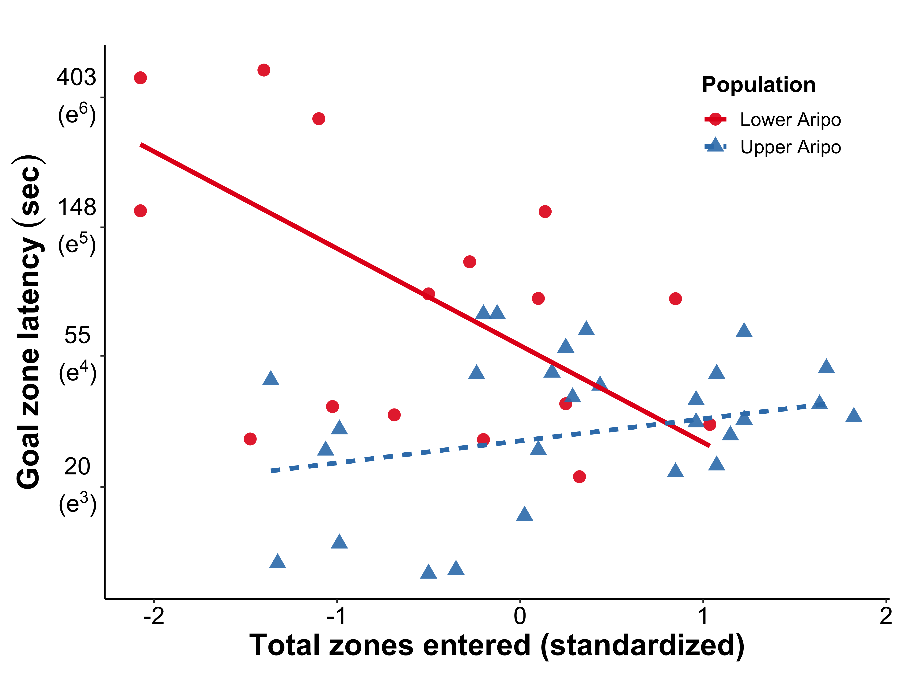

# Analysis: Population comparisons
- Author: Paul Q. Sims
- Contact: paul.q.sims@gmail.com
- Date: 2020
- Purpose: Population comparison analyses for Sims and Reader 2020


```r
knitr::opts_knit$set(root.dir = rprojroot::find_rstudio_root_file(),
                     eval = TRUE, echo = TRUE, message = FALSE,
                     warning = FALSE)
knitr::opts_chunk$set(root.dir = rprojroot::find_rstudio_root_file(),
                     eval = TRUE, echo = TRUE, message = FALSE,
                     warning = FALSE)
```

## Setup


```r
# Load libraries
library(tidyverse)  # for cleaning and modifying data
library(nlme)  # for mixed models and generalized least squares
library(broom)  # for tidying model output

# Load personalized functions
source("R/custom-functions.R")

# Read in data
data_analysis <-
  read_mod_data("data_Sims-Reader_2020")
```

## Population comparisons

### Body length, total zones entered

Create list of models for both variables


```r
m_length_totz_popcomp_tidy <- 
  data_analysis %>%
  select(group, pop, trial, body_length_LN, tot_z_LN) %>%
  filter(trial == 1) %>% 
  pivot_longer(cols = c("body_length_LN", "tot_z_LN"),  # reshape data
               names_to = "response",
               values_to = "value") %>%
  group_by(response) %>%
  nest() %>%
  mutate(model = map(data, ~lm(value ~ pop, data = .)),  # run models for each
         tidy_model = map(model, tidy)) %>%  # tidy output
  unnest(tidy_model) %>%
  rd_tidy_out(.) %>%  # round variables
  select(-c(data, model))  # extract relevant columns 
```

Body length population comparison model summary


```r
data_analysis %>%
  filter(trial == 1) %>%
  lm(body_length_LN ~ pop, data = .) %>%
  pretty_PredictTab(.)
```


Table: 

|term           |estimate |std.error |statistic |p.value |
|:--------------|:--------|:---------|:---------|:-------|
|(Intercept)    |3        |0.03      |101.11    |<0.001  |
|popUpper Aripo |0.07     |0.04      |1.84      |0.073   |

Total zones entered population comparison model summary


```r
data_analysis %>%
  filter(trial == 1) %>%
  lm(tot_z_LN ~ pop, data = .) %>%
  pretty_PredictTab(.)
```


Table: 

|term           |estimate |std.error |statistic |p.value |
|:--------------|:--------|:---------|:---------|:-------|
|(Intercept)    |4.27     |0.08      |53.56     |<0.001  |
|popUpper Aripo |0.28     |0.1       |2.76      |0.009   |

### Innovation: Goal zone latency

Fit innovation model


```r
# Create a data set without NAs - `lme()` won't remove them
data_analysis_NA_inno <-
  data_analysis %>%
  select(goal_z_lat_LN, pop, group,
         site_uni, trial) %>%
  drop_na() 

# Fit population comparison model
m_inno_pop_comp <- 
  lme(goal_z_lat_LN ~ pop + trial,
      weights = varIdent(form = ~ 1|site_uni * pop),  # control for heteroscedasticity
      random = ~ 1 | group,
      contrasts = list(trial = c(-1,1)),  # Change trial contrasts for marginal effects for average trial 
      data = data_analysis_NA_inno,
      method = "REML")
```

Innovation population comparison model summary


```r
# Tidy innovation predictor model
m_inno_pop_comp_tidy <-
  m_inno_pop_comp %>%
  pretty_PredictTab(., mixedModel = TRUE, kable = FALSE) %>%
  mutate(response = "goal_zone_lat_LN") %>%
  relocate(response) %>%
  filter(term != "trial1") %>%  # remove trial output as it is not of interest here
  select(-df)
```

```
## # A tibble: 3 x 6
##   term           estimate std.error df    statistic p.value
##   <chr>          <chr>    <chr>     <chr> <chr>     <chr>  
## 1 (Intercept)    3.96     0.19      43    20.67     <0.001 
## 2 popUpper Aripo -0.56    0.22      43    -2.53     0.015  
## 3 trial1         -0.07    0.09      40    -0.73     0.47
```

```r
m_inno_pop_comp_tidy %>%
  knitr::kable(.) 
```


|response         |term           |estimate |std.error |statistic |p.value |
|:----------------|:--------------|:--------|:---------|:---------|:-------|
|goal_zone_lat_LN |(Intercept)    |3.96     |0.19      |20.67     |<0.001  |
|goal_zone_lat_LN |popUpper Aripo |-0.56    |0.22      |-2.53     |0.015   |

## All population comparison model summaries


```r
# Bind all population comparisons together
m_pop_comp_final_tidy <-
  bind_rows(m_inno_pop_comp_tidy,
            m_length_totz_popcomp_tidy) %>%
  rename(predictor = "term")

m_pop_comp_final_tidy %>% # See reduced inno predictor model for trial measure of learning
  knitr::kable(.) 
```


|response         |predictor      |estimate |std.error |statistic |p.value |
|:----------------|:--------------|:--------|:---------|:---------|:-------|
|goal_zone_lat_LN |(Intercept)    |3.96     |0.19      |20.67     |<0.001  |
|goal_zone_lat_LN |popUpper Aripo |-0.56    |0.22      |-2.53     |0.015   |
|body_length_LN   |(Intercept)    |3        |0.03      |101.11    |<0.001  |
|body_length_LN   |popUpper Aripo |0.07     |0.04      |1.84      |0.073   |
|tot_z_LN         |(Intercept)    |4.27     |0.08      |53.56     |<0.001  |
|tot_z_LN         |popUpper Aripo |0.28     |0.1       |2.76      |0.009   |


# Analysis: Predictors of innovation 
- Author: Paul Q. Sims
- Contact: paul.q.sims@gmail.com
- Date: 2020
- Purpose: Predictors of innovation analyses for Sims and Reader 2020


```r
knitr::opts_knit$set(root.dir = rprojroot::find_rstudio_root_file(),
                     eval = TRUE, echo = TRUE, message = FALSE,
                     warning = FALSE)
knitr::opts_chunk$set(root.dir = rprojroot::find_rstudio_root_file(),
                     eval = TRUE, echo = TRUE, message = FALSE,
                     warning = FALSE)
```

## Setup


```r
# Load libraries
library(tidyverse)  # for cleaning and modifying data
library(nlme)  # for mixed models and generalized least squares

# Load personalized functions
source("R/custom-functions.R")

# Read in data
data_analysis <-
  read_mod_data("data_Sims-Reader_2020")

# Create dataset without NAs - lme won't remove them
data_analysis_NA_inno <-
  data_analysis %>%
  select(goal_z_lat_LN, tot_z_sc, pop, group,
         site_uni, body_length_sc, trial) %>%
  drop_na() 
```

## Random-effect testing

Check if there are significant among-group differences


```r
# Model formula for fixed-effects
inno_full_pred <- formula(goal_z_lat_LN ~ tot_z_sc * pop + 
                            body_length_sc * pop +
                            trial * pop)

# Fit model with group
m_inno_predict_full <-  
  lme(inno_full_pred,
      weights = varIdent(form = ~ 1|site_uni * pop),
      random = ~ 1 | group,
      data = data_analysis_NA_inno,
      method = "REML")

# Fit model without group
m1_inno_predict_red_rand <-  
  gls(inno_full_pred,
      weights = varIdent(form = ~ 1|site_uni * pop),
      data = data_analysis_NA_inno,
      method = "REML")

# Likelihood ratio test
anova(m_inno_predict_full, m1_inno_predict_red_rand) %>%
  as_tibble(.) %>%
  mutate(call = str_trunc(as.character(.$call), width = 10)) %>%  # condense call
  knitr::kable(., digits = 2, align = "l",
               caption = "Likielihood ratio test for group random effect") 
```


Table: Likielihood ratio test for group random effect

|call       |Model |df |AIC    |BIC    |logLik  |Test   |L.Ratio |p-value |
|:----------|:-----|:--|:------|:------|:-------|:------|:-------|:-------|
|lme.for... |1     |13 |246.26 |276.73 |-110.13 |       |NA      |NA      |
|gls(mod... |2     |12 |246.96 |275.09 |-111.48 |1 vs 2 |2.7     |0.1     |

## Fixed-effect selection

Test significance of interactions


```r
# Fit full model with ML 
m1_inno_predict_red_fix <-  
  update(m_inno_predict_full, method = "ML")

# Find largest non-significant p-value for interaction
model_sel_temp1 <- drop1(m1_inno_predict_red_fix, test = "Chi")
model_sel_temp1 %>%
  rd_stepwise_out(.) %>%
  knitr::kable(.) 
```


|Variable           |Df |AIC    |LRT  |p.value |
|:------------------|:--|:------|:----|:-------|
|<none>             |NA |233.03 |NA   |NA      |
|tot_z_sc:pop       |1  |240.94 |9.92 |0.002   |
|pop:body_length_sc |1  |231.12 |0.09 |0.76    |
|pop:trial          |1  |231.58 |0.55 |0.46    |

```r
# Remove largest non-significant p-value for interaction and update model and continue process
m1_temp <- update(m1_inno_predict_red_fix, ~ . -pop:body_length_sc)  # Remove most non-sig interactions
model_sel_temp2 <- drop1(m1_temp, test = "Chi")  # Update model and check remaining sig interactions
model_sel_temp2 %>%
  rd_stepwise_out(.) %>%
  knitr::kable(., caption = "No evidence for learning (i.e. trial) differences between populations (pop:trial)")
```


Table: No evidence for learning (i.e. trial) differences between populations (pop:trial)

|Variable       |Df |AIC    |LRT   |p.value |
|:--------------|:--|:------|:-----|:-------|
|<none>         |NA |231.12 |NA    |NA      |
|body_length_sc |1  |229.47 |0.35  |0.55    |
|tot_z_sc:pop   |1  |240.27 |11.15 |<0.001  |
|pop:trial      |1  |229.67 |0.55  |0.46    |

```r
m2_temp <- update(m1_temp, ~ . -pop:trial)  # same as above
model_sel_temp3 <- drop1(m2_temp, test = "Chi")  # same as above
model_sel_temp3 %>%
  rd_stepwise_out(.) %>%
  knitr::kable(.)
```


|Variable       |Df |AIC    |LRT   |p.value |
|:--------------|:--|:------|:-----|:-------|
|<none>         |NA |229.67 |NA    |NA      |
|body_length_sc |1  |228.09 |0.42  |0.52    |
|trial          |1  |228.08 |0.41  |0.52    |
|tot_z_sc:pop   |1  |238.44 |10.77 |0.001   |

```r
# Final model of innovation predictors
inno_pred_reduc <- update(inno_full_pred, ~ .  # Update fixef model formula
                            -pop:body_length_sc -pop:trial)
```

## Final model of predictors of innovation

Fit final model


```r
# Relevel population for testing total zones slope in other population
# data_analysis_NA_inno$pop <- relevel(data_analysis_NA_inno$pop, "Upper Aripo")  # Upper Aripo baseline
# data_analysis_NA_inno$pop <- relevel(data_analysis_NA_inno$pop, "Lower Aripo")  # Lower Aripo baseline, original 

# Fit final reduced model
m_inno_predict_reduc <- 
  lme(inno_pred_reduc,
      weights = varIdent(form = ~ 1|site_uni * pop),
      random = ~ 1 | group,
      contrasts = list(trial = c(-1,1)),  # Change trial contrasts in order to get marginal effects for average trial 
      data = data_analysis_NA_inno,
      method = "REML")
```

Final model summary


```r
# Tidy model output
pretty_PredictTab(m_inno_predict_reduc,
                  title = "Predictors of goal zone latency",
                  mixedModel = TRUE) 
```


Table: Predictors of goal zone latency

|term                    |estimate |std.error |df |statistic |p.value |
|:-----------------------|:--------|:---------|:--|:---------|:-------|
|(Intercept)             |4.08     |0.24      |40 |17.24     |<0.001  |
|tot_z_sc                |-0.75    |0.19      |39 |-3.88     |<0.001  |
|popUpper Aripo          |-0.73    |0.28      |39 |-2.62     |0.013   |
|body_length_sc          |-0.08    |0.12      |39 |-0.64     |0.52    |
|trial1                  |-0.04    |0.07      |40 |-0.65     |0.52    |
|tot_z_sc:popUpper Aripo |0.92     |0.25      |39 |3.74      |<0.001  |

```r
# R squared (delta)
knitr::kable(MuMIn::r.squaredGLMM(m_inno_predict_reduc),
      digits = 2, align = "l",
      caption = "Marginal and conditional R2")
```


Table: Marginal and conditional R2

|R2m  |R2c  |
|:----|:----|
|0.59 |0.87 |


# Figures
- Author: Paul Q. Sims
- Contact: paul.q.sims@gmail.com
- Date: 2020
- Purpose: Plots for Sims and Reader 2020


```r
knitr::opts_chunk$set(root.dir = rprojroot::find_rstudio_root_file(),
                      fig.path = "../figs/",
                     eval = TRUE, echo = FALSE, message = FALSE,
                     warning = FALSE, dev = c("png", "pdf"), dpi = 300)
knitr::opts_knit$set(root.dir = rprojroot::find_rstudio_root_file(),
                     eval = TRUE, echo = FALSE, message = FALSE,
                     warning = FALSE)
```

## Setup


## Population comparison of innovation

<!-- -->

## Innovation predicted by total zones entered

<!-- -->

